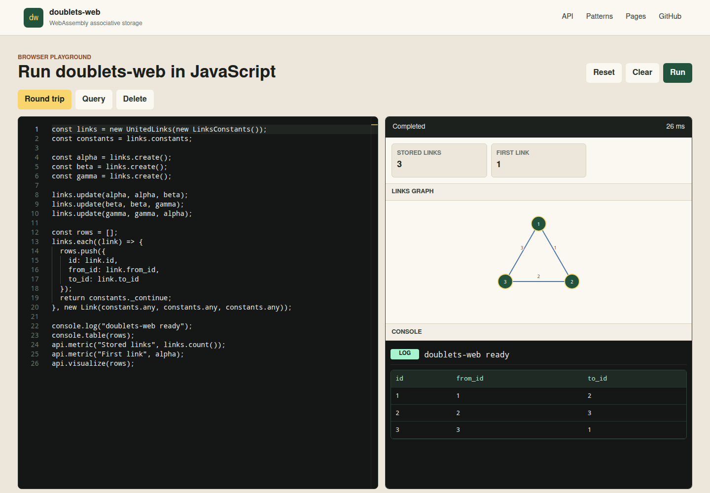
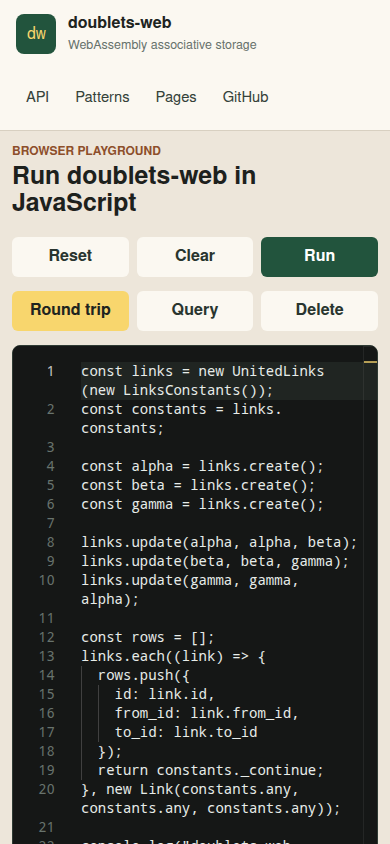

# Issue 9 Case Study: GitHub Pages JavaScript Playground

Date: 2026-05-08

Issue: https://github.com/linksplatform/doublets-web/issues/9
Pull request: https://github.com/linksplatform/doublets-web/pull/10

## Goal

Publish a GitHub Pages site that acts as both documentation and a no-install JavaScript playground for `doublets-web`. The first screen must let users edit and run JavaScript against the WebAssembly package, inspect console output, and see a visual representation of the stored doublets.

## Evidence Collected

- Issue 9 metadata and comments are saved under `evidence/issue-9*.json`.
- Pull request 10 metadata, comments, reviews, and review comments are saved under `evidence/pr-10*.json`.
- Current npm package metadata for Monaco, Vite, TypeScript, CodeMirror, Ace, xterm.js, DOMPurify, and `@types/node` is saved under `evidence/npm-*.json`.
- Current GitHub Pages action release metadata for `actions/configure-pages`, `actions/upload-pages-artifact`, and `actions/deploy-pages` is saved under `evidence/actions-*.json`.
- npm audit results before and after the DOMPurify override are saved under `evidence/npm-audit-site*.json`.
- Local command logs are saved under `logs/`.

## Requirements

- Add a hosted GitHub Pages demo for the repository.
- Provide a best-in-class JavaScript editor with syntax highlighting.
- Let users experiment with JavaScript and `doublets-web` without installing the package locally.
- Visualize browser console output inside the page.
- Explain and document the project, not only expose a playground.
- Collect issue-related data under `docs/case-studies/issue-9`.
- Research existing components and solution options.
- Plan and execute the work in one pull request.
- Update the release version because the project uses package versioning and release automation.

## Component Review

Monaco Editor was selected for the code editor because the official project describes it as the fully featured code editor from VS Code and it provides JavaScript language services suitable for a documentation playground. CodeMirror and Ace are strong browser editor components, but Monaco is a better fit for a polished developer-facing JavaScript workbench where users expect VS Code-like editing.

xterm.js was reviewed for console visualization. It is a terminal frontend, not a JavaScript console. The implemented console is purpose-built for browser playground output: it captures `log`, `info`, `warn`, `error`, `debug`, `table`, `clear`, metrics, thrown errors, and execution duration from the worker runtime.

Vite was selected for the static app build because it gives a modern ESM TypeScript workflow with straightforward GitHub Pages output. The WebAssembly package is generated by `wasm-pack --target web` and copied through Vite's public asset pipeline.

## Root Cause

The repository had a minimal webpack `testapp`, but no production documentation site, no GitHub Pages deployment workflow, and no browser-safe runner that could execute arbitrary demo JavaScript without freezing the UI. The existing package build workflow generated npm artifacts, but it did not create a browser-targeted wasm package for static hosting.

## Implemented

- Added `site/`, a Vite and TypeScript documentation app.
- Added Monaco Editor with JavaScript syntax highlighting and runtime type hints for `Link`, `LinksConstants`, `UnitedLinks`, `api.metric`, `api.visualize`, and `sleep`.
- Added a module worker runtime that imports the generated `site/public/pkg/doublets_web.js` package, initializes WebAssembly, executes user code, captures console calls, and lets the main thread terminate long-running scripts.
- Added visual output panels for metrics, `console.table`, plain console lines, errors, and a directed doublets graph.
- Added examples for create/update/query/delete flows.
- Added `.github/workflows/pages.yml` to deploy the generated static site to GitHub Pages.
- Extended `.github/workflows/release.yml` so PR CI also builds the browser demo package and Vite site.
- Added `tests/docs_site.rs` to assert the Pages and playground delivery surfaces are present.
- Updated README with the hosted demo URL and local playground commands.
- Bumped the crate/package version to `0.1.3`.
- Added screenshots under `docs/screenshots/` for PR review.
- Added a DOMPurify override to keep Monaco current while resolving npm audit findings.

## Verification

The docs-site regression test failed before implementation because the README did not contain the GitHub Pages URL. The failing log is saved in `logs/cargo-test-docs-site-before-host.log`.

Local verification completed successfully:

- `cargo fmt --all -- --check`
- `cargo check --locked --tests --all-features`
- `cargo test --locked --target "$(rustc -vV | sed -n 's/^host: //p')"`
- `cargo clippy --locked --tests --all-features -- -D warnings`
- `wasm-pack build --release --target bundler --out-dir pkg`
- `wasm-pack test --node`
- `npm pack --dry-run` from `pkg/`
- `npm audit --prefix site --json`
- `wasm-pack build --release --target web --out-dir site/public/pkg --out-name doublets_web`
- `npm run build --prefix site`
- `GITHUB_PAGES=true npm run build --prefix site`
- Playwright browser verification at `http://localhost:5173/`
- Playwright browser verification of the production artifact under `/doublets-web/`

Browser verification confirmed:

- Monaco renders the JavaScript editor.
- The worker initializes the generated wasm package.
- The default round-trip example completes.
- Console output and `console.table` render in-page.
- Metrics render in-page.
- The doublets graph renders as SVG.
- Query and delete examples complete.
- Desktop and mobile screenshots were captured.

## Screenshots

Desktop:

Mobile:

## Solution Plan for Similar Repositories

- Build the demo from the actual package artifact that users consume.
- Run arbitrary playground code in a worker so the page can stop infinite loops.
- Capture console output explicitly instead of relying on browser developer tools.
- Keep the documentation and playground in the same first-screen experience for developer libraries.
- Add CI coverage for the static site build, not only for the library package.
- Treat docs deployment workflows as release infrastructure and pin them to current action majors.
